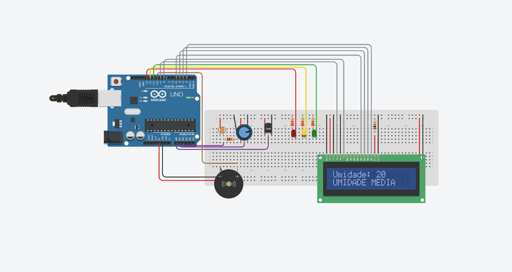

# Sprint - Challenge Mahindra 

## Nomes & RM's

<h2>

<li>Caio Suzano Ferreira da Silva: RM 554763</li>
<li>André Nakamatsu Rocha: RM555004</li>
<li>Matheus Rivera Montovaneli: RM 555499</li>
<li>Lucas Vasquez Silva: RM 555159 </li>
<li>Guilherme Linard F. R. Gozzi: RM 555768</li>

# Monitoramento das corridas de Formula E!

<h2>Link da simulação no <strong><a href="https://www.tinkercad.com/things/b6zULwnCGlu-mighty-hango-fyyran/editel?sharecode=jKtoHGyMiFxj-v5kXj2o_rZkWP5gXwZ2PBNmC2vrHWg">Tinkercad</a></strong> e vídeo no <a href="">Youtube</a></h2>

<li> 🔴 Vermelho: Ruim. </li>
<li> 🟡 Amarelo: Médio. </li>
<li> 🟢 Verde: Bom. </li>

## Componentes

<li>1x Arduino Uno R3</li>
<li>1x Fotorresistor</li> 
<li>1x Potenciômetro</li>
<li>1x Sensor de temperatura [TMP36]</li>
<li>1x Led Vermelho</li>
<li>1x Led Amarelo</li>
<li>1x Led Verde</li>
<li>3x Resistores 220</li>
<li>1x Piezo</li>
<li>1x LCD 16x2</li>
<li>1x Resistor 1k</li>

## Explicando o <a href="">Código</a>

## Objetivo

## License

Este projeto é licenciado sob a <strong>[Licença MIT](LICENSE).</strong>
